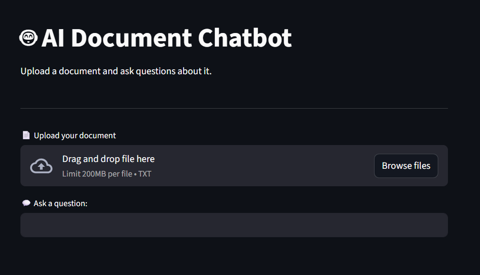

#  AI Document Chatbot

An AI-powered web application that allows users to upload documents and ask questions to extract relevant information using NLP techniques.

---

##  Live Demo

 https://ai-document-chatbot-cdvc27excvb9takfpxbmbd.streamlit.app/

---

##  Screenshot

---

##  Features

-  Upload your own text document  
-  Ask questions in natural language  
-  Semantic search using NLP  
-  Real-time answers  
-  Interactive web interface using Streamlit  

---

## Tech Stack

- Python  
- Streamlit  
- Scikit-learn  
- TF-IDF Vectorization  
- Cosine Similarity  

---

## How It Works

1. The uploaded document is split into smaller chunks  
2. Text is converted into numerical vectors using TF-IDF  
3. User query is also vectorized  
4. Cosine similarity is used to find the most relevant text  
5. The most relevant answer is displayed  

---

## How to Run Locally

1. Clone the repository:
git clone https://github.com/BunnyGitRepo/ai-document-chatbot.git

cd ai-document-chatbot

2. Install dependencies:
pip install -r requirements.txt

3. Run the app:
streamlit run app_ui.py

## Example

**Question: What is machine learning?**
**Answer: Machine learning is a subset of AI that allows systems to learn from data.**

---

## Future Improvements

- Support for PDF and DOCX files  
- Use advanced embeddings (OpenAI / Sentence Transformers)  
- Chat history and conversation memory  
- Better UI/UX enhancements  

---

## Author

**Rohan Bhargav**

- GitHub: https://github.com/BunnyGitRepo  
- LinkedIn: https://www.linkedin.com/in/rohanbhargav009/

---

## Acknowledgements

This project demonstrates practical implementation of NLP concepts such as text vectorization and semantic search in a real-world application.